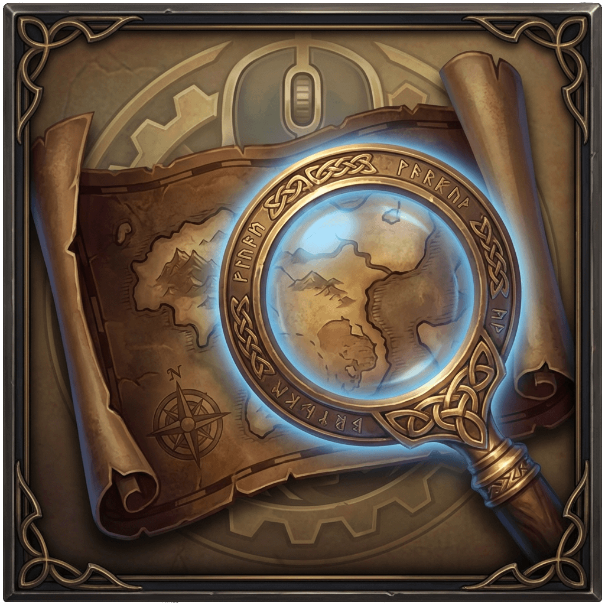
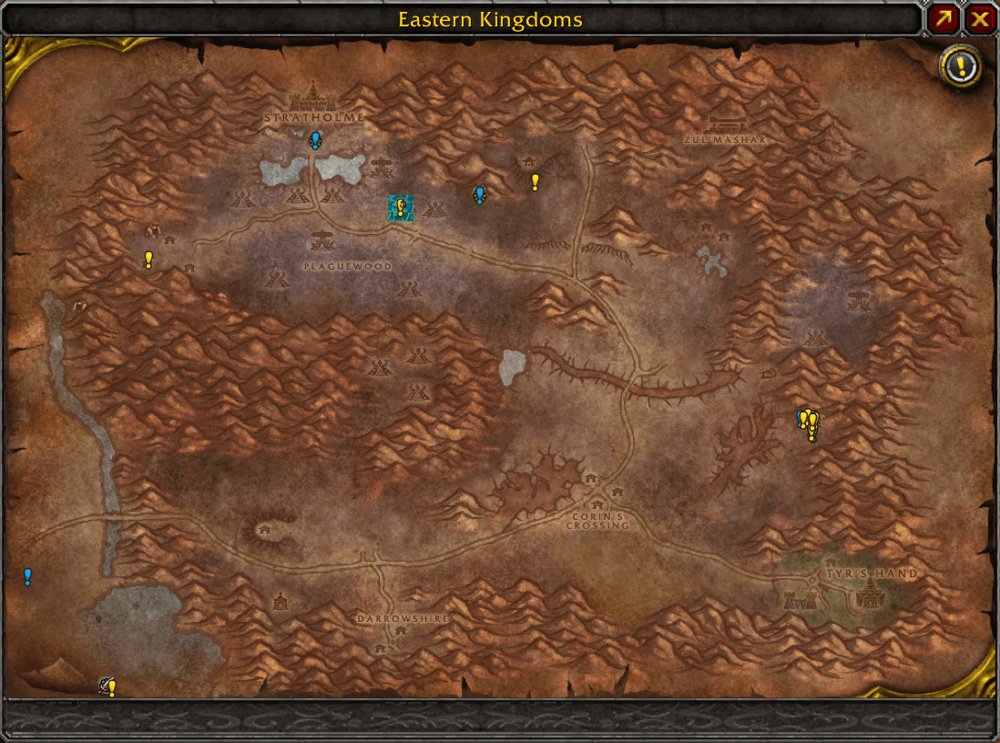
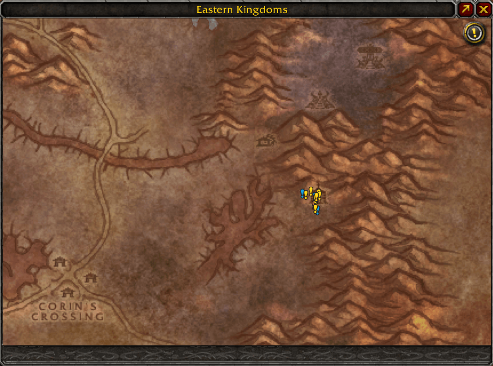
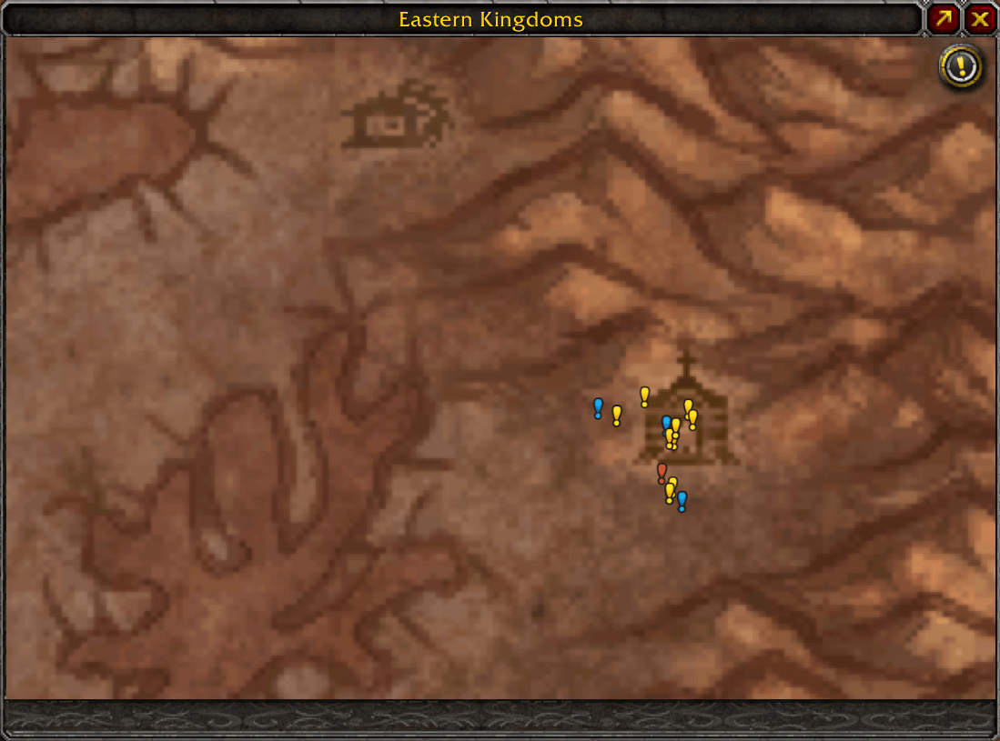
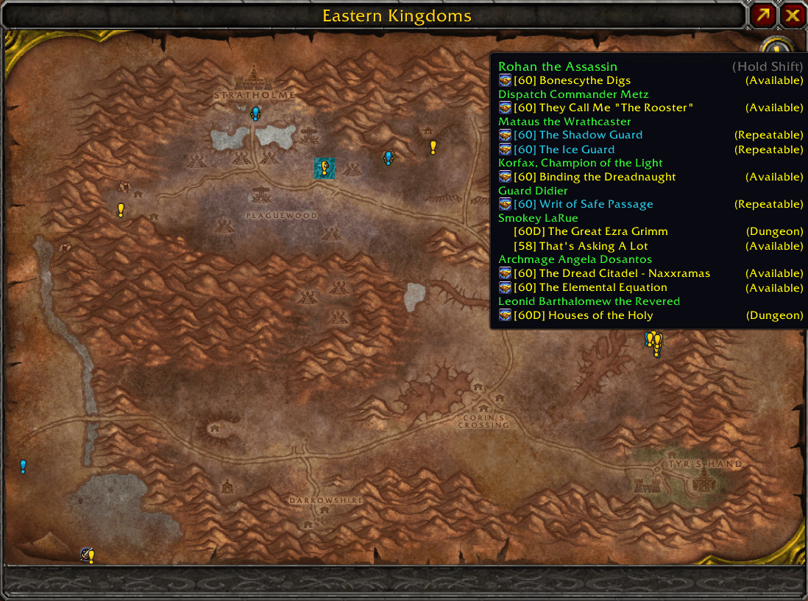
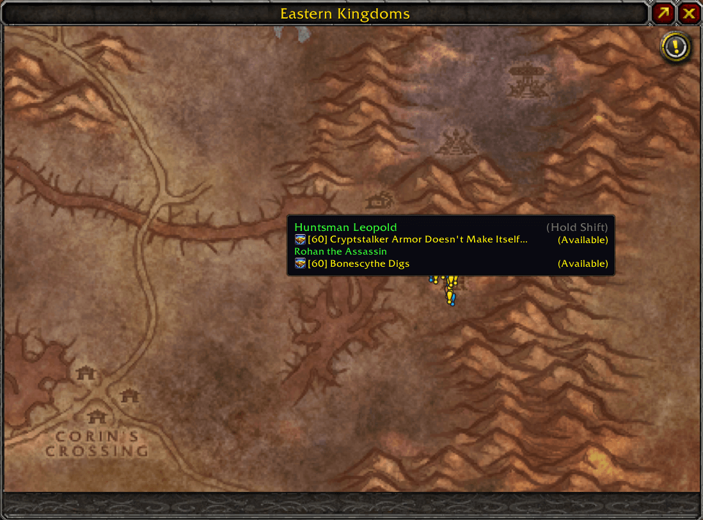
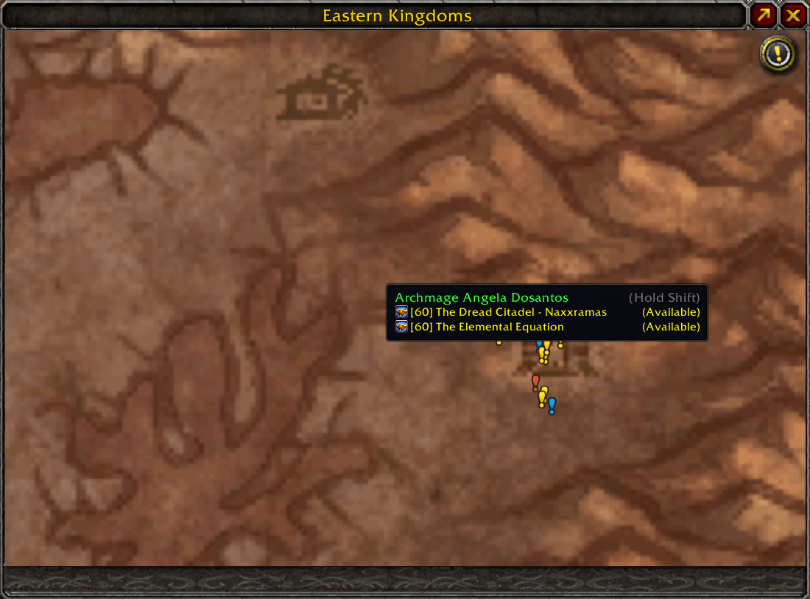
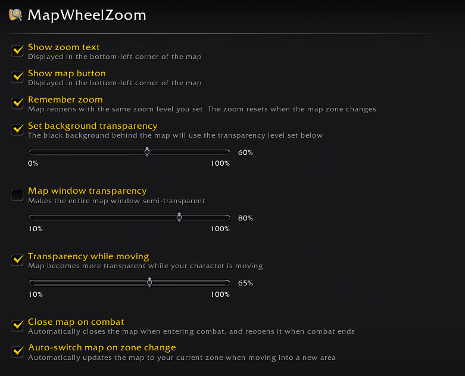

# MapWheelZoom

Mouse wheel zooming for World of Warcraft Classic Era world map.

## ✨ Features

- **Zoom to Cursor** - Map zooms in/out at your mouse cursor position
- **Questie Integration** - Quest clusters automatically adjust based on zoom level, and quest icons stay clipped within map boundaries when zooming and panning
- **TomTom Integration** - Place or remove TomTom waypoints anywhere on the map or icons via Ctrl + Left Click
- **Map Window Transparency** - Control overall map window opacity to see your surroundings
- **Transparency While Moving** - Automatically fades the map to a lower opacity while your character is moving
- **Close Map on Combat** - Automatically closes the map when entering combat and reopens it when combat ends
- **Auto-Switch Zone** - Automatically updates the map to your current zone when entering a new area
- **Background Transparency** - Control the opacity of the black bars on the sides of the world map
- **Saved Zoom** - Reopens the map at the same zoom and pan levels. You can disable this in settings.

## 📸 Screenshots

### Zoom Functionality

  

### Questie tooltips

  

### Settings

## ⚙️ Defaults

- **Show zoom text**: Disabled
- **Show map button**: Enabled
- **Remember zoom**: Enabled
- **Close map on combat**: Disabled
- **Auto-switch map on zone change**: Disabled
- **Set background transparency**: Disabled
- **Background transparency**: 65%
- **Map window transparency**: Disabled
- **Map window opacity**: 80%
- **Transparency while moving**: Disabled
- **Opacity while moving**: 40%

## ⚡ Performance

- **Lightweight Memory Footprint** - Uses only ~20–45KB of RAM

## 📦 Installation

1. Download the addon
2. Extract to `World of Warcraft\_classic_era_\Interface\AddOns\`
3. Restart WoW or type `/reload`

## 🎮 Usage

- **Mouse Wheel** - Scroll to zoom in/out at your cursor position
- **Click & Drag** - Click and drag to pan the map when zoomed in
- **Ctrl + Left Click** - Place or remove TomTom waypoints anywhere on the map canvas or icons
- **Slash Command** - Type `/mwz` or `/mapwheelzoom` to open the options panel

## 🔧 Compatibility

- Works with Questie addon for dynamic quest clustering and icon clipping
- Works with TomTom addon for quick waypoint placement
- May conflict with other addons that modify map zoom behavior

## Credits

- **Author**: KrevenRess
- **Made with**: ❤️ from 🇺🇦 Ukraine

## 📄 License

MIT License - see LICENSE file for details
